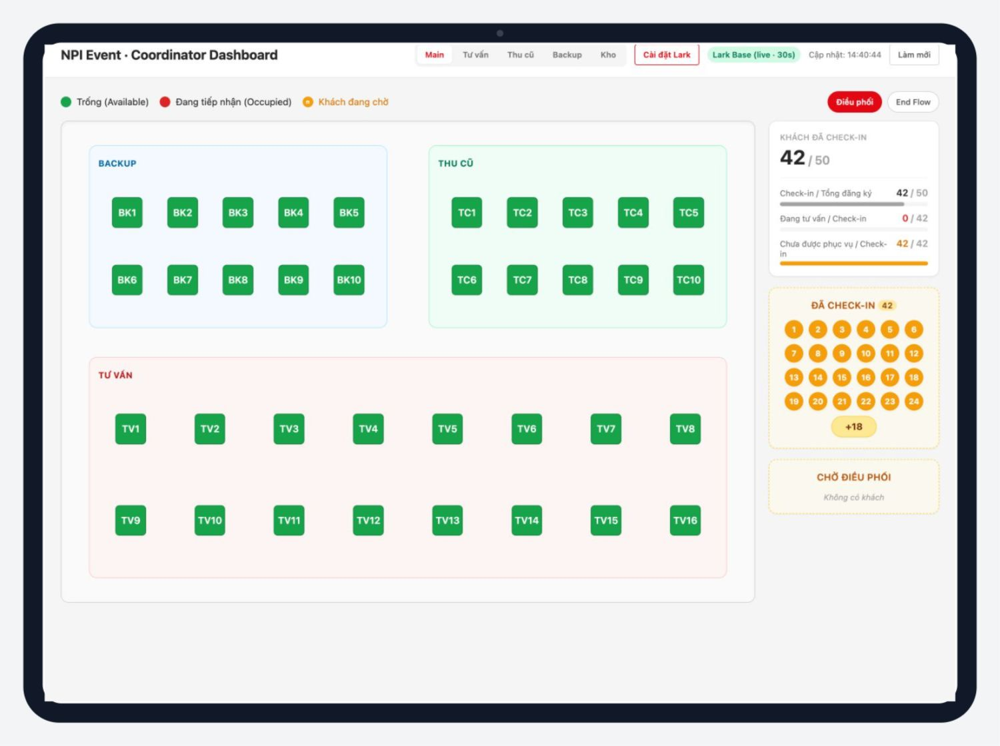
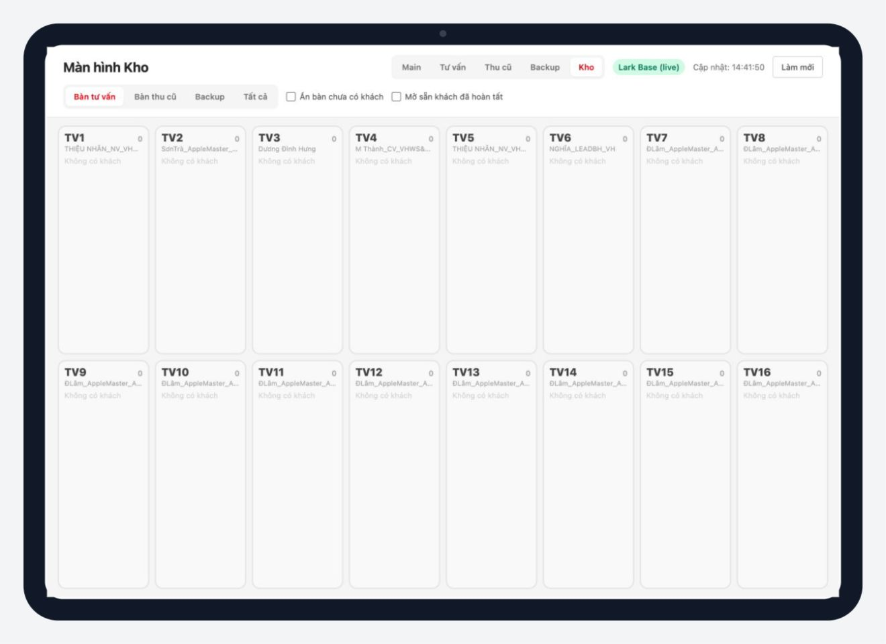
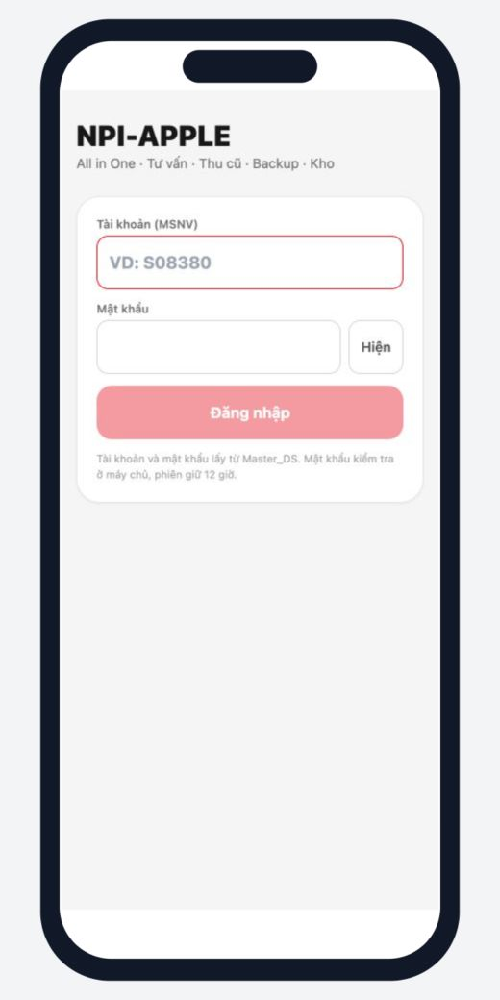

# Device UI Guide

> Audit giao diện: **2026-08-20** · Production: `https://apple.vhws.online` · Source: `main@fa71b61`

## 1. Mục đích

Tài liệu này quy định thiết bị, hướng màn hình, viewport kiểm tra và cách sử dụng giao diện tại event. Bộ ảnh hiện tại dùng giao diện production thật và không lưu tài khoản, mật khẩu hoặc dữ liệu khách hàng.

## 2. Ma trận thiết bị

| Vai trò | Thiết bị chính | Hướng dùng | Viewport audit | Route |
| --- | --- | --- | ---: | --- |
| Điều phối | iPad Pro/11 inch | Ngang | 1366×1024, 1180×820 | `#/` sau AIO role DP |
| Kho tổng quan | iPad | Ngang | 1180×820 | `#/khoview` |
| Kho bàn giao | iPad | Dọc hoặc ngang | kiểm tra theo camera thực tế | `/app` sau AIO role Kho |
| Tư vấn | iPhone | Dọc | 393×852, 375×667 | `/app` sau AIO role TV |
| Thu cũ | iPhone | Dọc | 393×852, 375×667 | `/app` sau AIO role TC |
| Backup | iPhone | Dọc | 393×852, 375×667 | `/app` sau AIO role BK |

## 3. iPad Điều phối

Ảnh nguồn: `assets/ui/production-dashboard-ipad-1366x1024.jpg`.

### Kết quả audit production

- Dashboard tải được dữ liệu live và hiển thị thời gian cập nhật.
- Thanh chuyển Main/Tư vấn/Thu cũ/Backup/Kho nằm trong vùng nhìn thấy.
- Sơ đồ bàn, chỉ số Check-in và khu Chờ Điều phối cùng xuất hiện trên viewport ngang.
- Không dùng viewport dọc làm chế độ vận hành chính vì giảm diện tích sơ đồ và popup.

### Checklist trước ca

1. Đặt iPad ngang và tắt khóa xoay.
2. Mở `/app`, đăng nhập tài khoản DP và chọn đúng `DP...` nếu có nhiều khu vực.
3. Kiểm tra nhãn Lark Base live và giờ cập nhật.
4. Mở thử một popup nhưng không submit để kiểm tra vùng nút không bị che.
5. Giữ mức zoom trình duyệt 100%.

## 4. iPad Kho

Ảnh nguồn: `assets/ui/production-kho-ipad-1180x820.jpg`.

### Hai chế độ sử dụng

- **Bảng Kho:** dùng iPad ngang để quan sát trạng thái theo bàn.
- **Bàn giao Kho trong AIO:** dùng dọc hoặc ngang tùy vị trí camera; QR phải là mã bàn Tư vấn `TV...`, không phải STT khách.

### Quy tắc giao diện Kho

- Không có trường STT khách trong form bàn giao.
- Trạng thái gửi là `Bàn giao kho`, không dùng `Hoàn tất`.
- Phải nhận diện được bàn TV và người nhận trước khi chụp ảnh.
- Tối đa ba ảnh; kiểm tra preview trước submit.
- Nếu QR không nhận, nhập mã bàn `TV...` chỉ để kiểm tra dữ liệu roster; không tự tạo bàn mới.

## 5. iPhone nhân sự

Ảnh nguồn: `assets/ui/production-aio-login-iphone-393x852.jpg`.

### Cổng vào chung

- Tất cả Tư vấn, Thu cũ, Backup và Kho vào `https://apple.vhws.online/app`.
- Đăng nhập bằng `NPI_AIO_User` và `NPI_AIO_Pass` trong `Master_DS`.
- Sau đăng nhập, App đi thẳng vào workspace duy nhất; nếu tài khoản có nhiều workspace thì hiện **Chọn khu vực**.
- Dùng nút Thoát trước khi bàn giao điện thoại cho người khác.

### Safe area và thao tác

- Dùng dọc; không cần xoay ngang cho luồng thường ngày.
- Nút hành động chính phải nằm trên vùng home indicator và không bị bàn phím che.
- Khi camera/album mở, quay lại App và xác nhận preview còn đủ ảnh.
- Không bấm submit lần hai chỉ vì dữ liệu chưa lập tức xuất hiện; trước hết kiểm tra trạng thái pending/cập nhật.

## 6. Trạng thái xác minh ảnh

| Ảnh | Nguồn | Trạng thái |
| --- | --- | --- |
| Dashboard Điều phối iPad | Production public route | Đã xác minh trực quan |
| Bảng Kho iPad | Production public route | Đã xác minh trực quan |
| AIO Login iPhone | Production `/app` | Đã xác minh trực quan |
| Staff TV1 legacy login | Production `#/tv1` | Đã chụp làm bằng chứng route, không dùng làm mockup chính |
| Tư vấn sau đăng nhập | Production AIO | Chưa chụp; cần phiên đăng nhập an toàn |
| Thu cũ sau đăng nhập | Production AIO | Chưa chụp; cần phiên đăng nhập an toàn |
| Backup sau đăng nhập | Production AIO | Chưa chụp; cần phiên đăng nhập an toàn |
| Kho bàn giao sau đăng nhập | Production AIO | Chưa chụp; cần phiên đăng nhập an toàn |

Không tự điền credential vào automation hoặc commit screenshot chứa credential. Chủ dự án có thể đăng nhập trực tiếp trên tab production; sau đó mới chụp các trạng thái sau đăng nhập và rà soát dữ liệu nhạy cảm.

## 7. Tiêu chí UI đạt trước event

- Không có cuộn ngang ở viewport mục tiêu.
- Tất cả nút hành động chính đọc được và bấm được ở zoom 100%.
- Popup không che nút submit hoặc nội dung bắt buộc.
- Màn hình hiển thị đúng vai trò, mã bàn và tên nhân sự.
- Camera QR/IMEI và chọn ảnh phải được kiểm tra trên thiết bị thật; browser desktop chỉ xác minh layout.
- Sau reload, App vẫn yêu cầu đúng phiên/role và không tự chuyển sang Dashboard ngoài ý muốn.

## 8. Hạn chế của lần audit này

- Screenshot public xác minh layout production, không chứng minh camera thật hoặc quyền Photos trên iOS.
- Chưa sử dụng credential nhân sự trong automation.
- Dữ liệu bảng Kho tại thời điểm chụp không có khách hoạt động; cần bổ sung ảnh trong giờ diễn tập/event nếu muốn minh họa card có dữ liệu.
- Đánh giá tải và thời gian đồng bộ thuộc `08-LOAD-CAPACITY-REPORT.md`, không suy ra từ screenshot.
